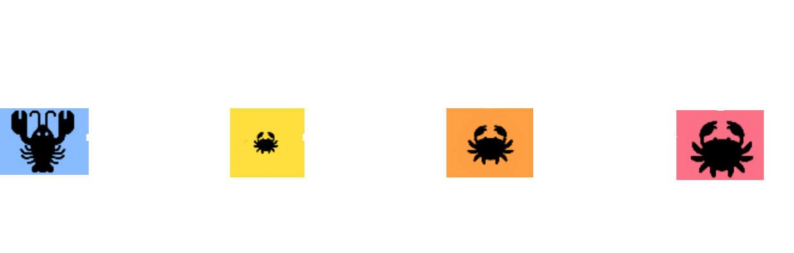
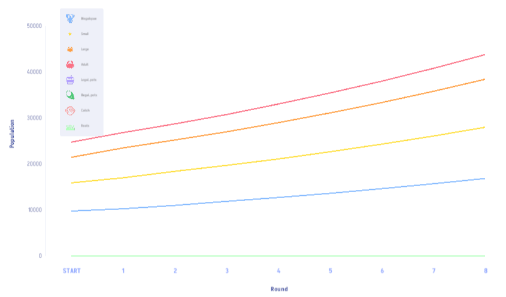

********************************************************************************

**Chesapeake Play! is a game about Maryland's blue crab management system. Players take on the role of fisherman (locally known as watermen) where players must balance the need to earn a living with the responsibility of maintaining a sustainable blue crab population.**

********************************************************************************

> [Play the game!](https://ecoknowgames.github.io/bluecrabs/)

> [Game instructions](#instructions)

> [The science](#science)

********************************************************************************

<a id="instructions">Game instructions</a>
================================================================================

Throughout the game, players face trade-offs: investing in legal crab pots that ensure regulatory compliance but come at a higher cost, or take a risk with cheaper illegal pots to maximise short-term profit. 
However, this can have consequences, in which patrol boats may appear, and if players are caught using illegal pots, they risk losing both their illegal and legal pots.  
Details are explained below, and [these screenshots](pdfs/ChesapeakePlay_summary.pdf) show where key game tools are located.

Success in game depends on strategically balancing risk and reward while managing blue crab resources responsibly to sustain livelihood and the Chesapeake Bay ecosystem.  

**Role**
--------------------------------------------------------------------------------

Take on the role of a waterman in the Chesapeake Bay.

**Goals**
--------------------------------------------------------------------------------

- Earn 200,000 within 8 game rounds
- Maintain a blue crab population above 20,000 for at least 6 rounds
  
**Getting started**
--------------------------------------------------------------------------------

Click 'Play' at the start of the game and select Level 1 to get started.
Choose 'Single Player' and set your name, then click 'Start game'.
The Chesapeake Bay map will open up, with tiles showing the locations of crabs at various life stages (megalopae, small, large, and adult), and patrol boats.
You begin the game with 12,000 in currency, and you can use this money to buy:

- Legal crab pots (more expensive, but no risk)
- Illegal crab pots (cheaper, but risky to use)

Legal crab pots only catch large and adult crabs, while illegal crab pots catch all life history stages.

********************************************************************************


********************************************************************************


********************************************************************************

Boats patrol the Chesapeake Bay waters, and if they find an illegal pot on a map tile, then they will destroy all legal and illegal pots on the tile, and confiscate any crab catch.

**Game play during rounds**
--------------------------------------------------------------------------------

Each round, you can buy new crab pots, then place them on the map to catch crabs. 
To do this, go to the menu on the right and click on one of the crab pot icons (purple for legal pots and dark green for illegal pots).
Click 'Introduce' to set the pots down.
You can select the tiles where you want to introduce the pots and place as many as you can afford on any map tiles.
Click 'Next Round' to end the round.
After you end the round, your pots will begin to catch crabs, increasing your crab catch on each tile.
Note that the crabs will move around and reproduce between rounds!

**Harvesting and selling**
--------------------------------------------------------------------------------

After putting down crab pots, you will start to see some crab catch on game tiles.
To harvest crabs, select the pink 'Catch' icon on the right of your screen.
From the pulldown menu, select 'Harvest'.
A popup screen will appear, and you can select 'Harvest' again in this popup.
You can select the tiles you want to harvest, or you 'Select All Tiles' from the pulldown menu if you want to harvest all of your catch (to do this quickly, select all tiles, then harvest 100% of the catch).

To sell your catch, click the 'Inventory' button on the left side of the screen.
You should see some Crab bushels in your inventory. 

********************************************************************************


********************************************************************************

You can sell as many units as you have available to accrue more money, which can then be reinvested into more crab pots.


**Game progression**
--------------------------------------------------------------------------------

Your money and total crab population size are shown in the top right corner of the screen.
These numbers are updated every round.
At any time, you can click the plot icon on the right side of the screen to track the crab population over time.
This population changes as predicted by the underlying scientific models.

********************************************************************************


<a id="science">The science</a>
================================================================================

This game uses a real-world model of how crab populations change over time.
It models the probability of individual survival, transition to the next life history stage, and reproduction.
Details of the life cycle are parameterised using the modelling work of @Miller2001 and @Miller2003.
@Miller2001 used data collected from the blue crab population and worked out the life cycle (Figure 1).

********************************************************************************



********************************************************************************

In this population, arrows moving from left to right show probabilities of transitioning from one stage to the next, or surviving as an adult crab, between years.
Arrows moving right to left show reproduction (only large and adult crabs can reproduce).
Mathematically, all of this is represented using a Leslie matrix,

$$\mathbf{A} = \begin{bmatrix}
0 & 0 & 0.664258 & 1.005550 \\
0.512401 & 0 & 0 & 0 \\
0.102796 & 0 & 0 & 0 \\
0 & 0.687241 & 0.687241 & 0.687241 
\end{bmatrix}.$$


In the game, we apply the above mathematics derived from @Miller2001 to model how the blue crab population will grow in the absence of any fishing. 
If we do not intervene in the game by putting down crab pots, the population will grow with stable stage classes.
Figure 2 below shows how the population will grow for each life stage.

********************************************************************************



********************************************************************************

```{r, echo = FALSE, eval = FALSE}
summer_data <- c(0.00000119, 0, 0, 0, 0, 0.705, 0.124, 0, 
                 0, 0, 0.829, 0, 0, 0, 0, 0.829);
winter_data <- c(0, 0, 558200, 845000, 0.705, 0, 0, 0, 
                 0.124, 0, 0, 0, 0, 0.829, 0.829, 0.829);
summer      <- matrix(data = summer_data, nrow = 4, byrow = TRUE);
winter      <- matrix(data = winter_data, nrow = 4, byrow = TRUE);
A_mat       <- summer %*% winter;
```


By playing this game, you are interacting with a real scientific model of the blue crab population in the Chesapeake Bay.
Your decisions concerning how much to fish and when mirror the real-life decision-making involved in managing blue crabs.

********************************************************************************

References
================================================================================


