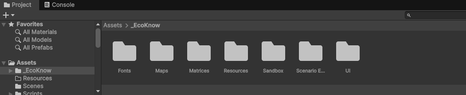
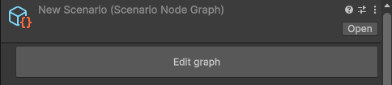

This document is intended to help you build a game using the [EcoKnowGames creator](https://github.com/EcoKnowGames/creator) tool.
The creator uses the [Unity Game Engine](https://unity.com/download) to build games that integrate scientific models and collect data on in-game environments and game player decisions.
Building these games does not require a high level of technical skill.
There is no coding involved, and while it is useful to understand the scientific models underlying game mechanics, these models are well-established and numerical details can be sourced from the scientific literature or pre-set examples.
All of the required software is free.
The real barrier to getting started is knowing (1) what to download and install, (2) how to use the EcoKnowGames creator in Unity, (3) how to deploy a game, and (4) how to collect in-game data.
This document will get you started and help you establish a work flow for building ecological knowledge games.
Once you are comfortable with this work flow, you should be able to create and deploy any number of turn-based games with unique interacting entities, game rules, and landscapes.

If you get stuck while working through this how-to, please let us know in the [EcoKnowGame Discussion](https://github.com/orgs/EcoKnowGames/discussions) or contact the [Project Leader](https://ecoknowgames.github.io/contact.html).
The [EcoKnowGames project](https://ecoknowgames.github.io/index.html) is a highly interdisciplinary research programme, and a key objective of it is to make knowledge game development accessible for researchers with as few technical hurdles as possible.

********************************************************************************

1. Downloading and installing
==================================

To build a game, you need to install git version control software, the [Unity Game Engine](https://unity.com/download), and the [EcoKnowGames creator](https://github.com/EcoKnowGames/creator) tool that works within Unity.
Both Unity and the EcoKnowGames creator are free and work across Windows, MacOS, and Linux.
We recommend downloading Unity first.

Downloading Unity
-----------------------------

You can download the Unity Hub here:

> https://unity.com/download (do not install the game engine yet)

Note that you will need to download the Unity Hub and the Unity game engine.
The Unity Hub is an application for accessing the Unity environment, and the game engine is used within it to build games.
Unity is regularly updating its game engine.
The version that you need is 6000.0, which you can find here:

> https://unity.com/releases/editor/whats-new/6000.0.65f1

The download takes a considerable amount of hard drive space. 
Even if you are only planning to use Unity for EcoKnowGames projects, you will probably need about 15 GB of space on your hard drive.

Downloading git
---------------------------

Next, we recommend downloading git (https://git-scm.com/).
Git is version control software; it tracks changes to files over time and allows you to view the entire history of a folder and keep multiple versions of it. 
You do not need to know how git works to build a game with EcoKnowGames, but it does need to be installed on your computer.
Git is free and open source, and it works for Windows, macOS, and Linux.
You can download it here:

> https://git-scm.com/install

Git is a very useful tool for managing large projects (and not just code).
The EcoKnowGames creator (and other tools in the EcoKnowGames project) use git, with files hosted on [GitHub](https://github.com) (https://github.com/EcoKnowGames/creator).

Downloading EcoKnowGames creator
----------------------------------

The EcoKnowGames creator works within Unity.
You can download the creator here:

> https://github.com/EcoKnowGames/creator/

If you are familiar with GitHub, then the best approach here would be to fork or clone the repository.
But you can also click the green button to open a pulldown menu, then choose 'Download ZIP'.
Extract the downloaded ZIP file and place the folder somewhere that you will be able to find it again.

Once you have downloaded Unity, git, and the EcoKnowGames creator, you are ready to get started in Unity.

********************************************************************************

2. How to use the EcoKnowGames creator
===========================================

To get started, you need to open Unity.
When you first open unity, you will be asked to create an account.
Once you create an account, you can sign into Unity Hub.
After agreeing to the Unity licence, Unity might recommend that you install the latest version of Unity; **do not update**.
The EcoKnowGames creator only works with 6000.0, so you do not want to update to a more recent version.
Skip the installation if you are prompted.
You should see a panel on the left with options that include 'Projects' and 'Installs'.
Click on 'Installs' first, then check to make sure that you have Unity 6000.0 LTS installed.
Now is a good time to also add some build support options.
Click the 'Manage' pulldown on the right and choose 'Add modules'.
If not installed already, then install 'Web Build Support'.

Next, navigate to 'Projects' from the options to the left.
This is how we get to the EcoKnowGames creator.
In the upper right, click the 'Add' pullown menu and choose 'Add project from disk'.
Find the EcoKnowGames folder that you downloaded, then click it and choose 'Open'. 
The new project should appear in your Projects list.

********************************************************************************

********************************************************************************

To get started, click on the 'creator' project (it might take some time to open).
When the creator opens, you will see a large developer environment with a lot of different panels.
The game display is the most prominent in the centre, but you should also see folders on the bottom, all of which are in a folder called '_EcoKnow', which is within 'Assets'.

********************************************************************************

********************************************************************************

In the _EcoKnow folder, there are subfolders: Fonts, Maps, Matrices, Resources, Sandbox, Scenario Editor, and UI.
You can safely ignore Fonts, Sandbox, and UI. 
The rest will be important for the workflow of game design:

- **Maps** are where all of the game maps are stored as plain text CSV files.
- **Matrices** define how different in-game entities (e.g., environmental resources or biological populations) interact with each other (more on this below), as stored in a plain text CSV file.
- **Resources** stores game art (in the 'Icons' folder) and the final game files (in the 'Scenarios' folder).
- **Scenario Editor** is where game mechanics are stored (e.g., win conditions, items, and generally how everything comes together to make a game).

We will go through the contents of each of these subfolders in the order in which they become relevant during game-making.
The starting place is the creation of a game matrix.

Game matrices
----------------------------------------

Every EcoKnowGames game is played on a map composed of discrete square tiles and discrete time steps (i.e., rounds).
A game matrix tells us how one entity on a tile will affect the count of another entity on the same tile in the next time step.
A concrete example will illustrate the idea.
Consider a game where there are three entities: Hare, Fox, and Rock.
Foxes eat hares, so all else being equal, adding a fox to a landscape tile will tend to decrease the number of hares on it.
Foxes benefit from this interaction, so all else being equal, adding hares to a landscape tile will tend to increase the number of foxes on it.
We will assume that rocks do not interact at all with hares or foxes.
The game matrix for this system is shown in Table 1.

|  Hare  |  Fox  |  Rock  |
|--------|-------|--------|
| -0.01  | -0.01 | 0      |
|  0.04  | -0.01 | 0      |
|  0     |  0    | 0      |

Table: EcoKnowGames matrix for setting up a game with a predator-prey relationship between hares and foxes, and rocks that are purely decorative.

Each number in the table above tells us how the entity in a given column affects the entity in a row.
For example, a hare (column 1) affects foxes (row 2) by increasing their numbers by a value of 0.04.
All else being equal, if there are 100 hares on a landscape tile, then the number of foxes in the next time step will increase by 4. 
Similarly, the -0.01 in column 1 and row 2 indicates that if there are 100 foxes on a landscape tile, then the number of hares in the next time step will decrease by 1.
Note that there is also a -0.01 in column 1 and row 1, and in column 2 and row 2.
This models self-regulation, so if the number of hares or foxes on a landscape tile is high, then that number will tend to decrease in the next time step (e.g., due to overcrowding or competition for resources). 
In contrast, the zeros in row and column 3 indicates that rocks are not affected by anything in the system, including themselves.

The actual details are a bit more complicated because the change in entity number will also be affected by its intrinsic growth rate.
More technically, games use generalised Lotka-Volterra equations to model entity dynamics, and game matrices are the interaction matrices used in these equations.
We do not need to worry about these details yet (and there are other possibilities for entity dynamics).
What matters for getting started is having a matrix with the format above ([see here](https://github.com/EcoKnowGames/creator/blob/main/Assets/_EcoKnow/Matrices/Hare%2C%20Fox%2C%20Rocks%20-%20Unstable.csv) for the CSV file) and having some intuitive sense of how it works.
The reason for making the underlying model so abstract is that this framework can be applied to a very wide range of complex system dynamics (i.e., not just predator-prey interactions, or even just biological interactions).
To get started quickly, we can use the [find_matrix](https://ecoknowgames.github.io/find_matrix/) application online to produce a stable random system:

> https://ecoknowgames.github.io/find_matrix/

Any set of entities generated with this application will be stable, in the sense that no entities will be driven extinct or exhibit endless growth.
To use the application, set the number of entities that you want and click 'Find Matrix', then download the CSV and record the r and N values.
You can rename the columns after downloading.
To see how these entities change over time in the absence of any player intervention, you can use the [simulation application](https://ecoknowgames.github.io/simulate/):

> https://ecoknowgames.github.io/simulate/

Upload the CSV file to the application, then input the intrinsic growth rates (r values) and abundances (N values) in the panel on the left. 
You can leave the number of rounds, landscape dimension, and movement parameters as they are.
When you click 'run simulation', the plot on the right should show all entities persisting at some finite abundance over time.
For now, this is all that is needed to set up a game, so we can move on to setting up a game map.

Game maps
----------------------------------------

Creating a map is more user friendly than creating the interaction matrix.
Making a map can be done with the [EcoKnow Map Editor](https://ecoknowgames.github.io/map/) online:

> https://ecoknowgames.github.io/map/

To use the map editor, upload the interaction matrix CSV file from the previous section.
Click 'Reset View' in the panel on the left to centre the map, and use W and H to change the size of the landscape.
Scroll down in the left panel and choose 'Terrain' to add green terrain tiles.
Terrain tiles will be playable in the game, while black tiles will be unplayable and empty (i.e., no entities can exist on them).

After adding terrain tiles to achieve the desired shape of the landscape, you can add any number of entities to each tile.
Click the entities in the left panel, then increase or decrease the number under 'Drawing Tools' to choose the amount of each entity to put on a tile.
To place the entities on a tile, simply click the tile.
You can thereby distribute entities over the landscape however you choose, and this will be the distribution of entities at the start of a game.
When you are finished, click 'Downlaod Map.csv' under 'Export' in the left panel.
You are now ready to start building the actual game in Unity.

Scenario Editor
-------------------------------

Recall the folders in the project tab from Figure 2.
Before doing anything else, put your newly created matrix in the 'Matrices' folder, and put your newly created map in the 'Maps' folder.
This will ensure that both are available in the Scenario Editor.
You might need to reopen the EcoKnowGames creator project from the start of Step 2 if you have closed out of it (see above).

From inside the creator, go to the bottom panel and find the 'Scenario Editor' folder on the left.
You might see some existing scenarios in the bottom middle.
Right click somewhere here to bring up a pull-down menu (Figure 3).

********************************************************************************

********************************************************************************

From the pull-down menu, navigate to 'Create', then 'Scenario Node Graph'.
This will bring up a new xNode to start building a game.
The xNode interface allows you to organise the game options.
Right click and hold to move around in xNode, and scroll to zoom in and out.
We recommend maximising xNode to give yourself as much space as possible, then placing game options in the following order:

1. **Scenario:** The first thing to do in xNode is right click somewhere in the middle and select 'Scenario'. A scenario box will pop up, which will allow you to specify the scenario name, author, total game rounds, actions that a player can take per round, and the amount currency a player has a the beginning of a game. You can also set a random seed value for the game, but this is not necessary.

2. **Matrix**: Right click to the left of the Scenario box and choose 'Matrix'. A box titled 'Matrix' will appear. In this box, to the right of 'Matrices CSV', you will see 'None', then a small circle on the far right. Click on this small circle to open a list of available CSV matrix files. Find the one that you made and select it; entities will automatically be filled in below. Lastly, click and hold on the red circle on the right of the Matrix box, then drag a line to the red dot called 'Matrix' in the Scenario box. The entities will then appear in circles on the right side of the Scenario box.

3. **Map**: Right click again to the left of the Scenario box and choose 'Map'. A box titled 'Map' will appear. Click and hold the yellow circle on the right side of the Map box, then drag a line to the yellow dot called 'Map' in the Scenario box.

4. **Entities**: On the right side of the scenario box, right click and choose 'Entity'. On the Scenario box, click and hold the 'Hare' circle, then drag a line to the circle on the left side of the new Entity box. On the right side of the new Entity box, there will be a right arrow followed by a set of ellipses (...). Click on the arrow to see the options for this entity. You should be able to edit the information here, including the icon, colour, growth rate, movement rate (i.e., probability of moving to an adjacent tile), densities of vulnerability and abundance, and the ability to harvest or introduce. But note that if this is not working for any reason, you can also close out xNode and edit this information directly in the Scenario Editor on Unity (see Figure 4). You can do this for any box that you place in xNode (note that when you attempt to select an icon, options appear from the Resources > Icons folder; you can place custom icons here to appear in the game). Repeat this process for all of the entities so that every entity is connected to the Scenario box.

********************************************************************************

********************************************************************************

5. **Items:** Items are things that players get from harvesting entities. Items can be potentially sold for currency or used to introduce other entities. For example, we might create a new item called 'hare meat' with a value of 2 currency. To create an item, right click to the left of the Scenario box and choose 'item'. Drag the grey circle on the right side of the newly created Item box to the 'Items' circle on the left side of the Scenario box. You will need to name the item and ideally give it an icon. You can connect as many items as you want to the Scenario box. 

6. **Item Quantity:** To make sure that you get items from harvesting an entity, right click somewhere and choose 'Item Quantity'. Choose the item that you want from the pull-down in the Item Quantity box (e.g., 'Hare meat'), then connect the blue 'Quantity' circle on the right to the 'Harvest Quantity' circle of an entity (see Figure 5).

7. **Currency Quantity:** To specify an amount of currency needed to introduce one entity to a tile, right click somewhere and choose 'Currency Quantity'. Specify a quantity in the box, then link the blue 'Quantity' circle to the blue 'Introduce Quantity' of an entity. Note that you can also link Item Quantity boxes to this 'Introduce Quantity' circle if you want introducing an entity to cost a specific number of items (or any combination of items and currency).

8. **Win Conditions:** Lastly, you need to specify what the win conditions are for the game. Win conditions are defined by keeping the total number of one or more entities within a specific range for a given number of rounds. For example, we might want to keep the total hare population between 100 and 2000 for 4 rounds (Figure 5).

********************************************************************************

![Figure 5: The xNode interface for using the EcoKnowGame creator tool. A simple game of three entities (hares, foxes, and rocks) is shown. The game will be played over 12 rounds with 4 actions per turn, and players start with a currency of 100. Players can harvest hares to get 4 hare meat items, which can be sold at a value of 2 currency each. Hares can be introduced to landscape tiles for 10 currency, and foxes can be introduced for 20 currency and 1 hare meat item. Players can win the game by keeping the total hare population between 100 and 2000 for 4 rounds.](img/xNode_eg.png)

********************************************************************************

Once you have your game set up, you need to export it as a JSON file and place it in the Resources > Scenarios folder.
There are two ways to do this.
First, from within xNode, you can right click and choose the 'Export JSON' option.
Second, you can go back to the Scenario Editor (i.e., bottom middle panel in Figure 4), then click on the Scenario icon ('New Scena...' in Figure 4).
In the upper right of the right panel, you will see vertical elipses (Figure 6, upper right).
Click these and select 'Export JSON' from the pull-down menu.
A pop up box will appear letting you know where the JSON file has been saved (it might not be where you expect, so look at the file path carefully).

********************************************************************************

********************************************************************************

The last thing to do is find your exported JSON file and move it into your Resources > Scenarios files in Unity.
Figure 7 shows an uploaded JSON file 'New Scenario.json' highlighted.

********************************************************************************

