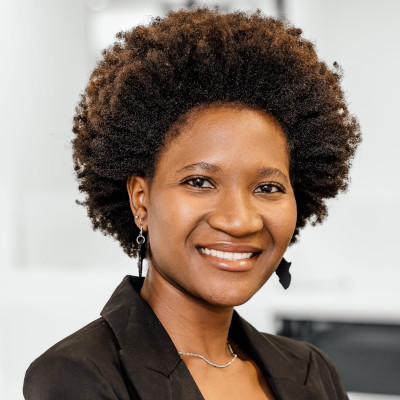
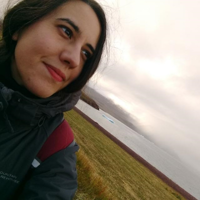
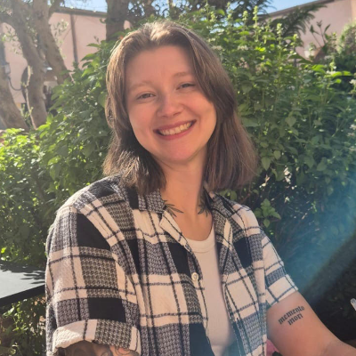
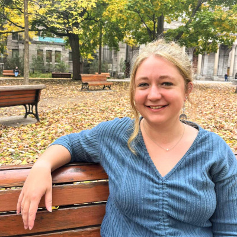
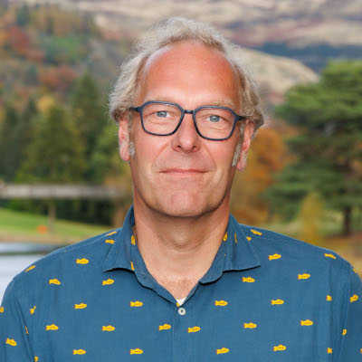

EcoKnowGames is led by an inter-disciplinary team with research interests and expertise that span the natural sciences, social sciences, and humanities. The academic team includes researchers at the [University of Stirling](https://www.stir.ac.uk/), the [James Hutton Institute](https://www.hutton.ac.uk/), and [King's College London](https://www.kcl.ac.uk/), and works closely with the game company [Glitchers](https://www.glitchers.com/).

**[Brad Duthie](http://bradduthie.github.io/)** (PL; he/him) is an evolutionary ecologist, ecological modeller, and biostatistician with broad interests in developing theory across the biological and environmental sciences. Brad is interested in the integration of knowledge games with social-ecological models. He built and maintains the GMSE (ConFooBio project) and resevol (ENDORSE project) R packages for social-ecological modelling and has published several papers using knowledge games to address questions on conservation and sustainable development.

Mastodon: [@bradduthie@ecoevo.social](https://ecoevo.social/@bradduthie)

**Theodor (Ted) Cimpeanu** (PDRA; he/him) is a Computer Scientist with a background in evolutionary game theory, computational social science and complex networks. Ted has worked extensively to build heuristics for better institutions and to mitigate risks in existential risks such as AI safety, but is now turning his interests towards conservation and the biology side of evolutionary biology. He hopes to explore and beautifully visualise game data, as well as simulate real player outcomes through mathematical models.

[Marly Muudeni Samuel](https://www.linkedin.com/in/marly-muudeni-samuel-7b1a3184/) (PDRA; she/her) is a postdoc research fellow at the University of Stirling. Her research work explores the intersection of digital technologies, heritage preservation and environmental conservation. It investigates different relationships people have with the environment and the role of technology in promoting environmental relationships and sustainability. For her PhD research, Marly leveraged participatory design and collaborated with coastal communities to co-produce the augmented reality application – Efuta Letu Sida Hurib (translated as: Our Ocean, Our Ocean) – that supports and preserves knowledge, practices, heritage and values related to the ocean. Marly has previously worked with marginalised communities in Namibia, promoting inclusive access to technology and equitable sustainable development. She is passionate about digital and innovative technologies, human-computer interaction, environmental sustainability and heritage preservation.  

**[Diana Valero](https://www.hutton.ac.uk/people/diana-valero/)** (Co-PL; she/her) is a social scientist at the James Hutton Institute with a background in political science, local development and rural policy. Diana works with people, communities and stakeholders to understand and address pressing societal challenges while supporting positive transformative change. Her research investigates social change and sustainable development, particularly in rural communities, in the light of challenges such us climate chaos, water scarcity and increasing social inequalities. She has written on how to use online games for collecting data, and is looking forward to advance how to advance games methods for research and evidencing policy.

Bluesky: [@dianaevalero.bsky.social](https://bsky.app/profile/dianaevalero.bsky.social)

[Chlo&#235; Corcoran](https://bsky.app/profile/chloecorcoran.bsky.social) (PhD Student; she/her) is a first year PhD student looking at stakeholder decision-making when it comes to trade-offs in sustainable development using mobile games. She has a background in Psychology (BSc and MSc), where she looked at Minecraft Education as a tool for educating children on climate change, and video games in general as a potential intervention for eco-anxiety. 

Bluesky: [@chloecorcoran.bsky.social](https://bsky.app/profile/chloecorcoran.bsky.social)

Yuan Pan (Co-PL; she/her) is a interdisciplinary environmental researcher focusing on developing digital solutions to connect humans with nature and conserve social-ecological systems. Her work also explores how popular culture and storytelling can shape societal relationships with nature and envision sustainable futures. Her expertise spans biodiversity conservation, community engagement, ecosystem services valuation, and natural capital assessment. As a British-born Chinese researcher, her ability to bridge cultural and linguistic divides has been instrumental in promoting international collaborations and addressing global environmental challenges.

Bluesky: [@yuanpan90.bsky.social](https://bsky.app/profile/yuanpan90.bsky.social)

Madelyn Kennedy (Msc Student; she/her) is a Msc Environmental Management (Energy) student at the University of Stirling. She has explored connections between people and the environment, including through environmental impact assessments, environmental policy, and environmental economics. She has a background in Environmental Studies and Political Science (BA) and has experience working with a wide range of stakeholders through past jobs and classes.  

[Nils Bunnefeld](https://www.stir.ac.uk/people/257162) (Co-PL; he/him) works at the interface between biodiversity and society combining natural and social sciences to improve our understanding of decision making from local to global levels in relation to natural resource use, climate change, people's livelihoods and sustainable development. He also contributes to science policy links on biodiversity through the European Eklipse initiative and the UNEP Agreement on the Conservation of African-Eurasian Migratory Waterbirds. In the EcoKnowGames project, Nils is responsible for the link to policy and exploring the role of knowledge games at the science policy interface.  

