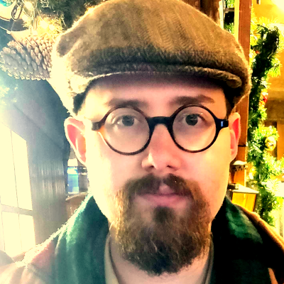
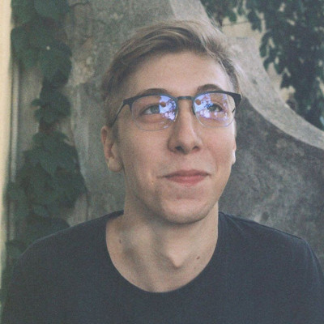

Some words about the team members

**[Brad Duthie](http://bradduthie.github.io/)** (PL; he/him) is an evolutionary ecologist, ecological modeller, and biostatistician with broad interests in developing theory across the biological and environmental sciences. Brad is interested in the integration of knowledge games with social-ecological models. He built and maintains the GMSE (ConFooBio project) and resevol (ENDORSE project) R packages for social-ecological modelling and has published several papers using knowledge games to address questions on conservation and sustainable development.

Mastodon: [@bradduthie@ecoevo.social](https://ecoevo.social/@bradduthie)

**Theodor Cimpeanu** (PDRA; he/him) is a Computer Scientist with a background in evolutionary game theory, computational social science and complex networks. Ted has worked extensively to build heuristics for better institutions and to mitigate risks in existential risks such as AI safety, but is now turning his interests towards conservation and the biology side of evolutionary biology. He hopes to explore and beautifully visualise game data, as well as simulate real player outcomes through mathematical models.

[Marly Muudeni Samuel](https://www.linkedin.com/in/marly-muudeni-samuel-7b1a3184/) (She/Her) is a postdoc research fellow at the University of Stirling. Her research work explores the intersection of digital technologies, heritage preservation and environmental conservation. It investigates different relationships people have with the environment and the role of technology in promoting environmental relationships and sustainability. For her PhD research, Marly leveraged participatory design and collaborated with coastal communities to co-produce the augmented reality application – Efuta Letu Sida Hurib (translated as: Our Ocean, Our Ocean) – that supports and preserves knowledge, practices, heritage and values related to the ocean. Marly has previously worked with marginalised communities in Namibia, promoting inclusive access to technology and equitable sustainable development. She is passionate about digital and innovative technologies, human-computer interaction, environmental sustainability and heritage preservation.  

